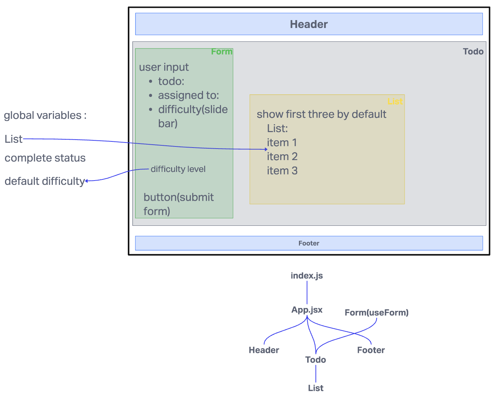

# LAB - Class 31

## Project: Todo-App

### Author: Brenda

### Problem Domain  

  User can add todo tasks to the proof-of-life starter application. n this phase, we will add hard-wired, default context settings to the application so that the user can view three incomplete todo tasks. In addition, the user will have the option of viewing any additional incomplete tasks by using pagination functionality.

### Links and Resources

- [GitHub Actions ci/cd](https://github.com/brenda70904/todo-app/actions)
<!-- - [back-end server url](http://xyz.com) (when applicable) -->
- [front-end application](https://todo-app-h2w6.onrender.com)

### Setup

<!-- #### `.env` requirements (where applicable) -->

#### How to initialize/run your application (where applicable)

- `npm start`

#### How to use your library (where applicable)

#### Features / Routes

- Feature One: Details of feature

#### Tests

- How do you run tests?
`npm test`
- Any tests of note?
- Describe any tests that you did not complete, skipped, etc

#### UML

class-31

class-32
